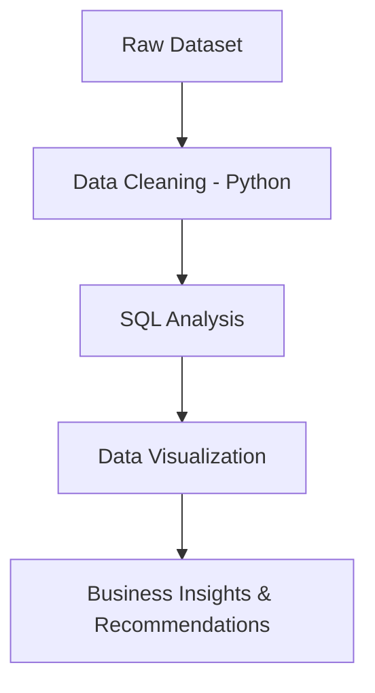

# 📊 Superstore Business Insights & Sales Performance Analysis

## 🚀 Overview

This project focuses on analyzing a real-world retail dataset to uncover **key business insights** related to sales, profit, customer behavior, and product performance.

The objective is to simulate a **consulting-style data analysis solution**, helping stakeholders make **data-driven decisions** to improve profitability and operational efficiency.

---

## 🎯 Business Problem

A superstore is facing:

* Inconsistent profits across regions
* High discounts impacting margins
* Lack of visibility into customer and product performance

👉 This project answers:

* Which products and regions are profitable?
* Where is the business losing money?
* How do discounts impact profit?
* Who are the most valuable customers?

---

## 🛠️ Tech Stack

* **Python (Pandas)** → Data Cleaning & Transformation
* **SQL (SQLite in Colab)** → Data Analysis
* **Power BI** → Interactive Dashboard
* **Google Colab** → Development Environment

---

## ⚙️ Project Workflow



---

## 📂 Project Structure

```
superstore-business-analysis/
│
├── data/
│   ├── Sample - Superstore.csv
│   ├── cleaned_superstore.csv
│
├── notebook/
│   ├── superstore_analysis.ipynb
│
├── dashboard/
│   ├── insights_dashboard.pbix
│
├── README.md
```

---

## 📊 Key Analysis Performed

### 🔹 1. Sales & Profit Analysis

* Region-wise performance
* Category & sub-category insights

### 🔹 2. Discount Impact Analysis

* Identified correlation between **high discounts and losses**

### 🔹 3. Loss-Making Products

* Detected sub-categories generating negative profit

### 🔹 4. Customer Analysis

* Top customers contributing majority revenue (Pareto principle)

### 🔹 5. Time-Based Trends

* Monthly sales and profit trends

---

## 📈 Dashboard Features (Power BI)

* 📌 KPI Cards → Total Sales, Profit, Orders
* 📌 Sales vs Profit by Region
* 📌 Discount vs Profit Analysis
* 📌 Top Customers & Products
* 📌 Monthly Sales Trend
* 📌 Loss-Making Categories

---

## 💡 Key Business Insights

* 🔻 High discounts significantly reduce profit margins
* 📉 Some sub-categories (e.g., Tables, Bookcases) are consistently loss-making
* 🌍 Certain regions generate high sales but low profit
* 👥 Top 20% customers contribute a large portion of revenue

---

## 🧠 Recommendations

* Optimize discount strategies to protect profit margins
* Focus on high-performing regions and products
* Re-evaluate pricing for loss-making sub-categories
* Strengthen relationships with high-value customers

---

## ▶️ How to Run the Project

1. Open the notebook in **Google Colab**
2. Upload the dataset
3. Run all cells for:

   * Data cleaning
   * SQL analysis
4. Export cleaned data
5. Open Power BI file to view dashboard

---

## 📸 Sample Outputs

> 


---

## 🌟 Project Highlights

✔ End-to-end data analysis project
✔ Real-world dataset
✔ Business-focused insights
✔ Dashboard-driven storytelling
✔ Strong alignment with Data Analyst / Consulting roles

---

## 👨‍💻 Author

**Kumar Gaurav**
📧 [gauravraj5485@gmail.com](mailto:gauravraj5485@gmail.com)
🔗 LinkedIn | GitHub

---

## ⭐ If you like this project

Give it a ⭐ on GitHub and feel free to connect!
